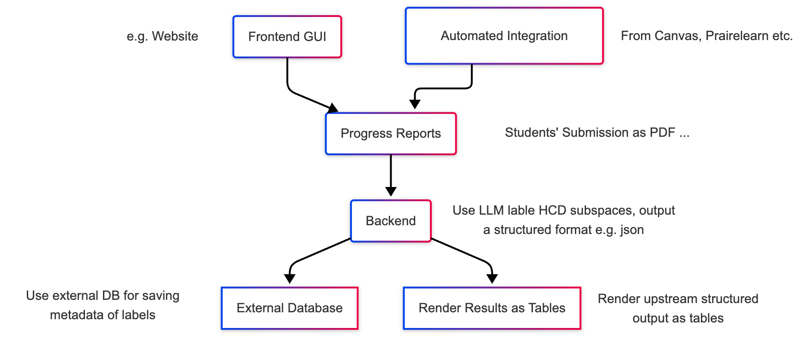

# SIIP HCD Classifier

[](https://www.python.org/)
[](https://fastapi.tiangolo.com/)
[](https://github.com/langchain-ai/langchain)
[](https://www.langgraph.dev/)
[](https://www.docker.com/)

An LLM-powered automation tool supporting the Strategic Instructional Innovations Program (SIIP) project: **[Redesigning Design: Incorporating HCD and the 3 C's in Capstone Design Courses](https://ae3.grainger.illinois.edu/programs/siip-grants/64451)**.

This tool automates the classification of student activities into Human-Centered Design (HCD) spaces and subspaces, facilitating data analysis for instructional improvement.

---

## ✨ Features

- 🤖 **LLM-Powered Classification**: Automatically classifies text data using advanced LLMs (OpenAI).
- 📊 **Multimodal Processing**: Supports PDF document parsing and structured data extraction.
- 🏷️ **Data Labeling Workflow**: Includes specialized endpoints for batch data labeling and progress tracking.
- 📈 **Stats & Analytics**: Real-time monitoring of labeling progress and annotation reconciliation.
- 🚀 **Production Ready**: Fully containerized with Docker and ready for Cloud Run deployment.

---

## 🛠️ Architecture

The system follows a pipeline architecture:
1. **Preprocessing**: Extracted text from PDFs is cleaned and normalized.
2. **LLM Processing**: LangGraph-powered agents perform initial HCD classification.
3. **Post-processing**: Results are validated and formatted for database storage.



---

## 🚀 Quick Start

### 1. Prerequisites
- Python 3.8+
- OpenAI API Key

### 2. Installation
```bash
git clone https://github.com/Haozhe-Li/SIIP-HCD-classifier.git
cd SIIP-HCD-classifier
pip install -r requirements.txt
```

### 3. Configuration
Copy `.env.example` to `.env` and fill in your credentials:
```bash
cp .env.example .env
```
Update `.env`:
```env
OPENAI_API_KEY=your-api-key
D1_DATABASE_ID=your-database-id
# ... other vars
```

### 4. Run API Server
```bash
uvicorn main:app --reload
```
Access the API documentation at `http://localhost:8000/docs`.

---

## 📡 API Overview

| Endpoint | Method | Description |
| :--- | :--- | :--- |
| `/classify` | `POST` | Upload PDF and get HCD classifications |
| `/fetch-unlabeled` | `GET` | Retrieve next activity for manual labeling |
| `/label-activity` | `POST` | Submit a manual annotation |
| `/label-stats` | `GET` | View labeling progress statistics |
| `/health` | `GET` | API health check |

---

## 📦 Project Structure

```text
├── core/               # Main logic (Preprocessing, LLM Processing)
├── database/           # DB connection and queries
├── docs/               # Technical designs and diagrams
├── main.py             # FastAPI entry point
├── Dockerfile          # Container configuration
└── requirements.txt    # Project dependencies
```

---

## ☁️ Deployment

### Google Cloud Run
1. Connect this repo to a **Google Cloud Run** service.
2. Ensure **Continuous Deployment** from GitHub.
3. Add environment variables in the Cloud Run console (Variables & Secrets).
4. Deploy!

For more detail, see [Technical Design](./docs/DESIGN.md).
