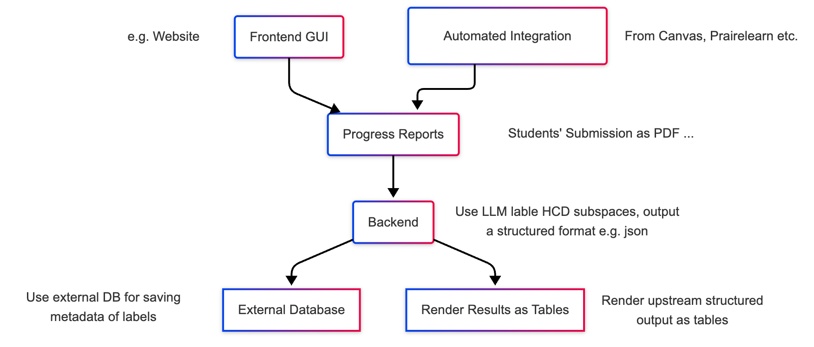

# Design Proposal

Haozhe Li | Zhicheng Hu

Below is our initial design for this project.

## Architecture

#### High Level Design

**High Level Design**

The project is organized into five main components:

- **Frontend GUI** – A web interface that lets students and instructors upload progress reports.
- **Automated Integration** – Seamless ingestion of submissions from learning‑management systems (e.g., Canvas, Moodle) via their public APIs.
- **Backend Core** – The system’s heart, using large‑language models to extract and evaluate students’ labeled HCD subspaces. This is the focus for the fall semester.
- **External Database** – Once the backend is ready, an external database will store metadata for further analysis.
- **Results Renderer** – Backend outputs will be presented in a clear, tabular format.

  

#### Backend Core Design

The Backend are consist of two parts: **Preprocessing** and **Inference**.

**Preprocessing**:

This stage will first receive a student's progress report in multiple formats, like PDF or DOCX. It will then parse the report into Markdown text. To stay within the context limit, the system will split this text into smaller chunks using a hybrid chunking method.

**Inference**:

The chunked text will be fed to two separate LLMs simultaneously:

1. The HCD LLM will provide a result that includes reasoning and references based on the student's description.

2. The Student's HCD LLM will extract the student's HCD Labels.

Next, these two results will be merged and fed into the Post Check LLM. This final LLM will compare the two inputs, perform any necessary fixes, and output the final, verified labels.

## What We Need

**1. Annotation Rubric**  
Create a clear, unambiguous rubric that follows the HCD framework outlined in the course proposal and the student progress report template.

- The rubric must define all 20 HCD subspaces (e.g., Exploration, Observation, Empathy, etc.) in precise terms.
- Include three example categories:
  - **Green** – student activity descriptions that fully match the subspace definition.
  - **Red** – clear examples of incorrect annotation.
  - **Yellow** – ambiguous cases where the description lacks enough information for a definitive judgment.

**2. Test Set**  
Compile a test set of at least 10 correctly labeled examples that **adhere strictly to the rubric**.

- Ensure the set is **highly consistent**.
- Whenever possible, have experts—such as professors or faculty staff well versed in HCD principles—label the examples.
- Call this collection the **Ground Truth**; it will be used to evaluate system performance.

**3. Training Set (Not Needed for now)**

Create a training set for fine‑tuning the AI system.

- The data **should contain no overlapping examples with test set**; splits must be clearly defined.
- While more data is preferable, the set must still adhere strictly to the rubric above.

A training set is **not required** at this stage, as we will first test zero‑shot prompting.

## Project Plan

#### Phase 1 – Prototype & Initial Evaluation

| Week | Dates        | Tasks                                                                                                                                                     |
| ---- | ------------ | --------------------------------------------------------------------------------------------------------------------------------------------------------- |
| 1    | Oct 19–25    | • Draft initial project design • Prepare design proposal & architecture diagram • Set up the project repository • **Annotation Rubric**          |
| 2    | Oct 26–Nov 1 | • Build backend preprocessing prototype • Building test set strictly follows rubric                                                                    |
| 3    | Nov 2–8      | • Build backend LLM‑and‑output prototype • Building test set strictly follows rubric                                                                   |
| 4    | Nov 9–15     | • Deliver Phase 1 demo • Evaluate precision and accuracy, based on previous test set • Discuss next steps (e.g., fine‑tuning vs. moving to Phase 3) |

#### Phase 2 – Precision & Accuracy Improvements _(to be defined)_

Details will be added once we finish Phase 1

| Week | Dates        | Planned Activities                |
| ---- | ------------ | --------------------------------- |
| 5    | Nov 16–22    | • Refine based on Phase 1 results |
| 6    | Nov 23–29    | • Continue refinement             |
| 7    | Nov 30–Dec 6 | • Iterate and test                |
| 8    | Dec 7–13     | • Finalize accuracy gains         |

#### Phase 3 – GUI & Automated Integration _(to be defined)_

| Week | Dates | Planned Activities |
| ---- | ----- | ------------------ |
| 9    | ...   | • …                |
| 10   | ...   | • …                |

_(Phase 3 details will be added later.)_
