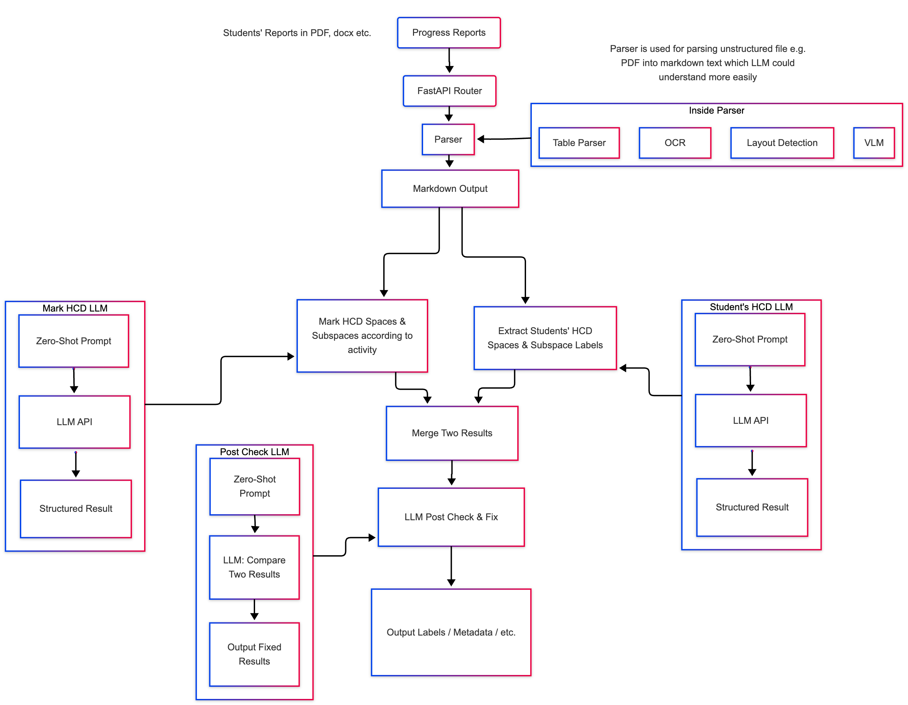

# Design Proposal

Below is our initial design for this project.

## Architecture

#### High Level Design

**High Level Design**

The project is organized into five main components:

- **Frontend GUI** – A web interface that lets students and instructors upload progress reports.
- **Automated Integration** – Seamless ingestion of submissions from learning‑management systems (e.g., Canvas, Moodle) via their public APIs.
- **Backend Core** – The system’s heart, using large‑language models to extract and evaluate students’ labeled HCD subspaces. This is the focus for the fall semester.
- **External Database** – Once the backend is ready, an external database will store metadata for further analysis.
- **Results Renderer** – Backend outputs will be presented in a clear, tabular format.

  

#### Backend Core Design

...

## Project Plan

#### Phase 1 – Prototype & Initial Evaluation

| Week | Dates        | Tasks                                                                                                                         |
| ---- | ------------ | ----------------------------------------------------------------------------------------------------------------------------- |
| 1    | Oct 19–25    | • Draft initial project design • Prepare design proposal & architecture diagram • Set up the project repository         |
| 2    | Oct 26–Nov 1 | • Build backend preprocessing prototype                                                                                       |
| 3    | Nov 2–8      | • Build backend LLM‑and‑output prototype                                                                                      |
| 4    | Nov 9–15     | • Deliver Phase 1 demo • Evaluate precision and accuracy • Discuss next steps (e.g., fine‑tuning vs. moving to Phase 3) |

#### Phase 2 – Precision & Accuracy Improvements _(to be defined)_

Details will be added once we finish Phase 1

| Week | Dates        | Planned Activities                |
| ---- | ------------ | --------------------------------- |
| 5    | Nov 16–22    | • Refine based on Phase 1 results |
| 6    | Nov 23–29    | • Continue refinement             |
| 7    | Nov 30–Dec 6 | • Iterate and test                |
| 8    | Dec 7–13     | • Finalize accuracy gains         |

#### Phase 3 – GUI & Automated Integration _(to be defined)_

| Week | Dates | Planned Activities |
| ---- | ----- | ------------------ |
| 9    | ...   | • …                |
| 10   | ...   | • …                |

_(Phase 3 details will be added later.)_

## Challenges

We have identified several key challenges that may arise in the future.

### 1. Subjectivity and Consistency

The greatest risk to the project is the inherent subjectivity of LLM judgments. Even with defined assessment criteria, the model’s responses can vary, producing inconsistent results for similar content. Because LLMs are probabilistic, we cannot eliminate this variability entirely, but we can keep it within an acceptable range.

**Possible solutions:**

- Provide highly detailed evidence criteria in the prompt.
- Lower Temperature in terms of hyper-parameter of LLM
- Use few‑shot prompting techniques.
- Teach the model a chain‑of‑thought (CoT) that guides its reasoning.
- Agentic Design, create a ReACT agent which will reason, reflect by itself.
- Apply supervised fine‑tuning (SFT), or combine the above methods.

Each approach has its own trade‑offs, so we will experiment with different combinations, gather feedback, and adjust our strategy accordingly.

### 2. LLM Context Window Limit

A student’s design report can be long, and adding a prompt with a few-shot examples may exceed the LLM’s token limit.

**Solution:**  
We employ a smart chunking algorithm that splits the report into manageable segments. These chunks are processed iteratively by the downstream pipeline, preventing us from hitting the context window limit. However, chunking may further weaken evaluation consistency.

### 3. Cost

API calls to powerful LLMs are expensive, especially at scale. Using SFT models can increase costs by 2× or more. We will estimate the budget after completing our prototype pipeline and conducting small‑scale tests.
